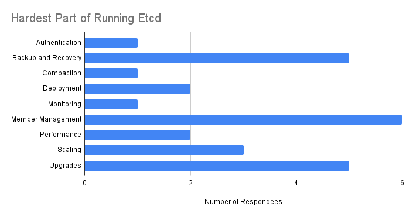

# Etcd Operator Survey Results

# Survey Responses and Data Cleaning

We received 52 survey responses to the Etcd Operator Survey.  

Of these 52, 10 were removed from the aggregate results below:

* One did not complete the survey  
* Two said they would not use an official operator  
* Eight responses came from a single organization, and as such were condensed into a single response before computing it.

[Detailed summary result sheet](https://docs.google.com/spreadsheets/d/1Wria1k3I4nrV2OgorDjvr4-aucoBc\_oszrdmWCPrW1c/edit?gid=0\#gid=0) has the full anonymized data.

# Survey Population

Almost everyone uses Etcd at work.  A few use it at school or for personal projects, but most of those also use it at work.

Folks generally run Etcd as Kubernetes pods.  Only about ⅓ of those use static pods.

Our surveyees divide into thirds; one-third runs fewer than ten etcd clusters, one-third runs more than 100, and one-third is in between.

Our respondees largely already use older or custom operators:

# Feature Priorities

Required features fall naturally into four clusters:

## Universal Features:

These features were required by more than 78% of respondees.  Interestingly, no required feature, even cluster creation, was 100% universal.

* Creation of a 3 or 5 node etcd cluster  
* Understanding health of a cluster

## Popular Features:

These features were required by more than 52% of respondees:

* Upgrading a cluster by one minor version  
* Understanding performance of a cluster  
* Upgrading a cluster between patch versions  
* Enabling TLS communication  
* Creating on-demand backups of a cluster  
* Recovering a single failed cluster node (still have quorum)  
* Creating a new cluster from a backup  
* Creating periodic backups of a cluster

## Common Features

These features were required by 33-52% of respondees:

* Recovering from multiple failed cluster nodes (quorum loss)  
* Growing a one node cluster to a 3 node cluster  
* Growing a 3 node cluster to a 5 node cluster  
* Creation of a single node etcd cluster  
* Upgrading a cluster by multiple minor versions  
* “Rolling back” a cluster to a backup  
* Creation of a cluster with learners  
* Shrinking a 5 node cluster to a 3 node cluster  
* Shrinking a 3 node cluster to a 1 node cluster  
* Expanding size of backing cloud volumes

## Uncommon Features

These features were required by less than ⅓ of respondees:

* 1:1 exchange of one node with another node (e.g. to change cloud zones)  
* Downgrading a cluster by one minor version  
* Downgrading a cluster between patch versions  
* Moving a cluster node between cloud zones  
* Shrinking size of backing cloud volumes  
* Downgrading a cluster by multiple minor version  
* Moving cloud volumes between types (e.g. HDD \-\> SSD)  
* Enabling unencrypted communication  
* Moving cloud volumes between zones

## Suggested Features

These features were not part of our list, but were suggested requirements by various respondees:

* Automatic TLS certificate renewal  
* Ability to customize etcd configuration parameters  
* Multi-cluster support (X2)  
* Automated database compaction  
* Ability to customize etcd pod spec

## Big User vs. Small User Features

Since our surveyees divide neatly into thirds, I wanted to see if there was any required features which were notably different between Big (\>100) and Small (\< 10) users.  As it turned out, there wasn’t much difference that didn’t look more like individual user differences.

Big Users did find recovering from quorum loss to be more important, and small users found growing clusters by numbers of nodes more important.  However, at 14 respondees per group, these preference differences may not be significant.

## Hardest Part of Etcd

We asked users what the hardest parts of etcd were, which gives suggestions for pain we could automate away.  We sorted these into several categories, with some respondees naming more than one category.

